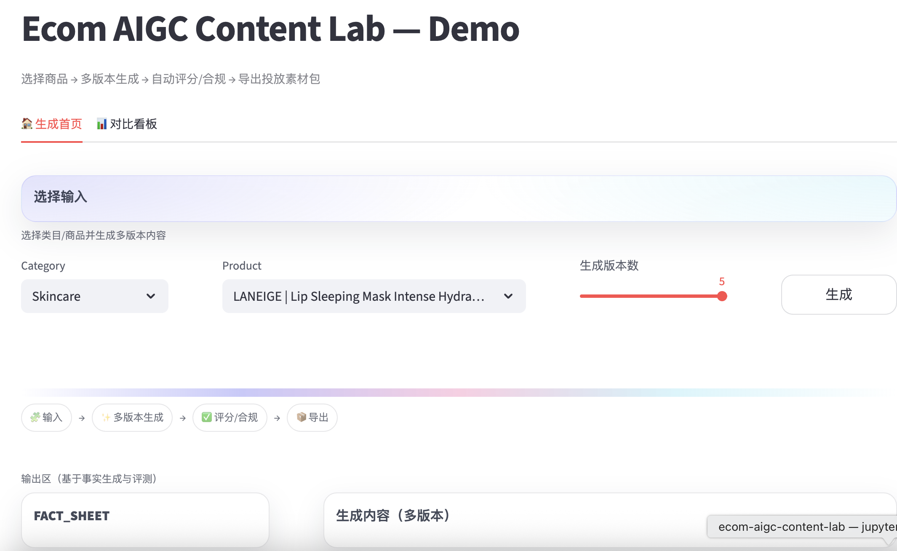
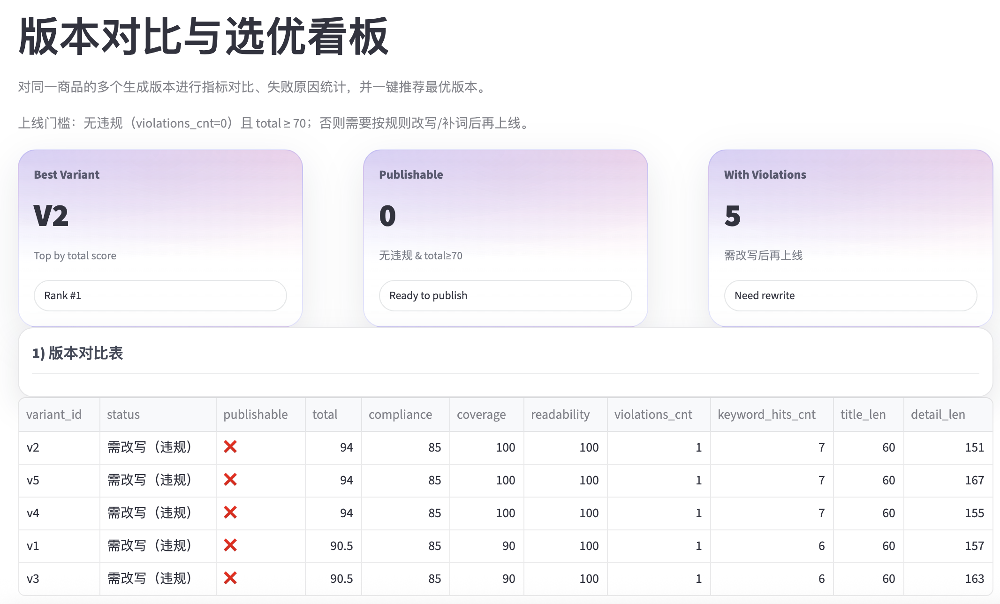

一个面向电商的 AIGC 内容中台实验项目：用商品信息 + 用户评论生成商品卖点文案，并用可量化指标评估生成质量。
  
  ## Demo
  - Live demo: 【https://ecom-aigc-content-lab-fuetjapp5aohzuatuewydxz.streamlit.app/】
  - Repo: 【https://github.com/yunacong/ecom-aigc-content-lab】
  
  ## What it does
  选择商品 → 多版本生成 → 自动评分/合规 → 版本对比与选优 → 一键导出投放素材包（JSON/TXT）  
  并提供回归评测（promptfoo）保证规则不被改坏。
  
  ## Key features
  - FACT_SHEET 事实约束（防幻觉）
  - CONTENT_SPEC 输出规范（可控、可评测）
  - policy_rules 合规拦截（禁用词/风险提示）
  - 多版本生成 + 自动评分 + compare 看板
  - promptfoo 回归测试（10→30 可扩展）
  
Demo Home screenshot: [demo_home.png](ecom-aigc/docs/images/demo_home.png)
Demo Compare screenshot: [demo_compare.png](ecom-aigc/docs/images/demo_compare.png)

 
 
  
